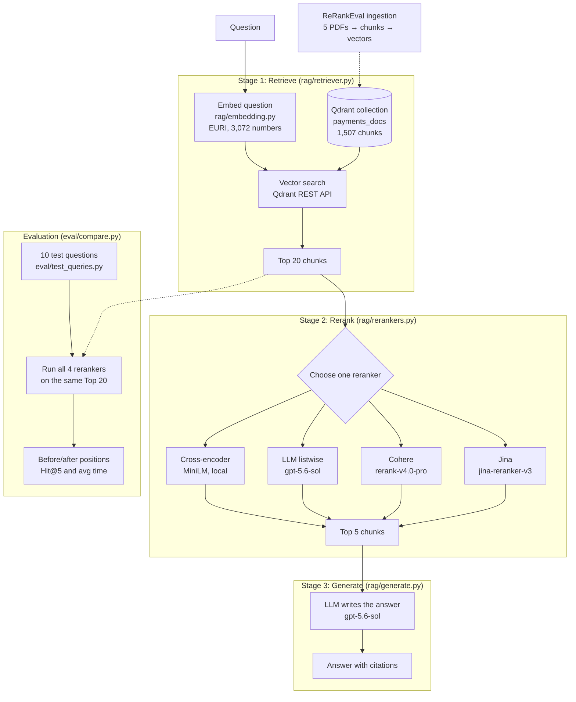

# RAG Reranker Comparison

A small RAG pipeline that retrieves the **Top 20** chunks for a question, **reranks** them, and sends only the **Top 5** to an LLM. Four reranking approaches are implemented and compared on the same questions, showing the ranking before and after reranking.

## Architecture



**Why rerank?** Vector search (a bi-encoder) is fast but imprecise. It embeds the question and each chunk separately, so it finds chunks on the right *topic*, but struggles to tell which one actually *answers* the question. A reranker reads the question and each chunk together and reorders them by relevance. Because only 5 chunks reach the LLM, getting the right chunk into the Top 5 decides the quality of the answer.

## The pipeline

```
Question
   ↓
Stage 1: Retrieve   vector search in Qdrant → Top 20 chunks          (rag/retriever.py)
   ↓
Stage 2: Rerank     one of four rerankers reorders the 20 → Top 5    (rag/rerankers.py)
   ↓
Stage 3: Generate   the LLM answers using only those 5 chunks        (rag/generate.py)
```

## The four rerankers

| Reranker | How it works | Runs | Model |
|---|---|---|---|
| Cross-encoder | A small model reads the question + one chunk together and outputs a score | Locally, free | `cross-encoder/ms-marco-MiniLM-L-6-v2` |
| LLM (listwise) | A general LLM sees all 20 chunks in one prompt and returns them in order | EURI API | `gpt-5.6-sol` |
| Cohere | A large model built only for reranking; returns a score per chunk | Cohere API | `rerank-v4.0-pro` |
| Jina | Another purpose-built reranker, listwise, from a different vendor | Jina API | `jina-reranker-v3` |

## Results

10 test questions over 5 payment-industry PDFs (PCI DSS, CPMI principles for FMIs, cross-border payments roadmap, a payment methods guide, and the FCA's payment services and e-money approach). Each question has a known answer page.

**Position of the first answer chunk** (lower is better; `*` = outside the Top 5, so the LLM never sees it):

| q | Vector (before) | Cross-encoder | LLM | Cohere | Jina |
|---|---|---|---|---|---|
| 1 | 3 | 3 | 1 | 1 | 2 |
| 2 | 1 | 1 | 1 | 1 | 1 |
| 3 | 1 | 1 | 1 | 1 | 1 |
| 4 | 1 | 2 | 1 | 1 | 1 |
| 5 | 2 | 15* | 1 | 1 | 2 |
| 6 | 15* | 6* | 1 | 1 | 1 |
| 7 | 2 | 4 | 2 | 1 | 2 |
| 8 | 1 | 8* | 1 | 1 | 1 |
| 9 | 6* | 4 | 1 | 1 | 2 |
| 10 | 1 | 1 | 1 | 1 | 1 |

**Summary** (Hit@5 = in how many questions the answer reached the Top 5):

| Method | Hit@5 | Avg time per question |
|---|---|---|
| Vector (no reranking) | 8/10 | – |
| Cross-encoder | 7/10 | 1.29s |
| LLM | 10/10 | 4.47s |
| Cohere | 10/10 | 1.04s |
| Jina | 10/10 | 0.81s |

### Key findings

- **Reranking can rescue a buried answer.** In question 6, vector search placed the answer 15th. The LLM, Cohere and Jina all moved it to 1st.
- **Reranking can also hurt.** The small cross-encoder pushed correct answers out of the Top 5 in questions 5 and 8, scoring below no reranking at all. It's a general web-search model reading specialised, partly scrambled PDF text, and it favoured overview pages that repeat the question's words.
- **The dedicated rerankers were the best trade-off.** Cohere placed the answer 1st in all 10 questions, and Jina was the fastest. The LLM matched them on accuracy but was about 4× slower and used roughly 4,000–9,000 tokens per question.
- **The reranker decides the answer's quality.** On question 5, the same LLM gave a 2-point answer when the cross-encoder dropped the answer page, and a 5-point answer when Cohere kept it.

Results come from a small test set (10 questions), so they show a clear pattern rather than a universal ranking. LLM reranking can vary slightly between runs.


## Why the ordering changed: a worked example

**Question 8:** *"What does PCI DSS Requirement 3 say about protecting cardholder data?"* The answer is on page 14 of the PCI DSS guide, which was split into two chunks.

| Chunk | What it actually contains | Vector | Cross-encoder | LLM | Cohere | Jina |
|---|---|---|---|---|---|---|
| p.14 (first chunk) | The "Protect Cardholder Data" section, but the text is scrambled: two columns and an "Encryption Primer" sidebar were mixed together by PDF extraction | 1 | 8 | 1 | 1 | 1 |
| p.14 (second chunk) | The actual rules, e.g. "3.3 Mask PAN when displayed". Starts mid-word and never says "Requirement 3" | 5 | 18 | 2 | 5 | 4 |
| p.11 | A general introduction: "the goal of PCI DSS is to protect cardholder data…" | 3 | **1** | 6 | 7 | 6 |
| p.40 | The back-cover summary of the whole standard | 4 | **2** | 4–5 | 4 | 2 |
| p.9 | The list of all 12 requirements, including Requirement 3's title | 8 | **3** | 5–6 | 2 | 3 |

**Vector search** ranked by overall topic similarity. All 20 chunks were PCI DSS pages with near-identical scores (0.788 for 1st vs 0.787 for 2nd), so it found the right neighbourhood but could barely separate the answer from its neighbours.

**The cross-encoder** moved general overview pages (p.11, p.40, p.9) to the top and pushed both answer chunks out of the Top 5, for three reasons:
1. **It rewards wording that matches the question.** The overview pages repeat "protect cardholder data" in clean sentences.
2. **It reads word by word, so scrambled text looks incoherent.** The first p.14 chunk was marked down for its mixed-up columns.
3. **It doesn't know the document's structure.** It couldn't link "3.3 Mask PAN" to Requirement 3, so the chunk with the actual rules dropped to 18th.

**The LLM** understood the question rather than matching words. It recognised that sub-requirement 3.3 belongs to Requirement 3 and read past the scrambled text, so it put both answer chunks 1st and 2nd.

**Cohere and Jina** kept the first answer chunk at 1st and the second in the Top 5. They also raised p.9 (the list of requirements), which names Requirement 3 and is partly relevant.

**The lesson:** vector search finds chunks that are *about* the topic, a small general-purpose reranker can prefer chunks that *sound like* the question, and stronger rerankers pick the chunk that *answers* it. Data quality matters too: a reranker can only judge the text PDF extraction gives it.


## Project structure

```
RAG-Reranker-Comparison/
  rag/
    embedding.py      EURI embedder (copied from ReRankEval)
    chat_model.py     EURI chat model wrapper (copied from ReRankEval)
    retriever.py      Stage 1: Top 20 from Qdrant
    rerankers.py      Stage 2: the four rerankers
    generate.py       Stage 3: answer from the Top 5; runs the whole pipeline
  eval/
    test_queries.py   10 questions with their answer pages (copied from ReRankEval)
    compare.py        runs all rerankers on all questions and prints the results
  tests/
    test_connection.py
```

## Setup

**1. The document collection.** This project reads an existing Qdrant collection built by [ReRankEval](../ReRankEval)'s ingestion (1,507 chunks, 3,072-dimension EURI embeddings). Run ReRankEval's `python -m rag.ingest` first, with `QDRANT_COLLECTION=payments_docs`.

**2. Environment variables.** Copy `.env.example` to `.env` and fill in:

```
EURI_API_KEY, EURI_BASE_URL, EURI_EMBED_MODEL, CHAT_MODEL
QDRANT_URL, QDRANT_API_KEY, QDRANT_COLLECTION
COHERE_API_KEY, JINA_API_KEY
```

The EURI and Qdrant values must match the ones ReRankEval used for ingestion, especially `EURI_EMBED_MODEL`, so questions are embedded the same way as the stored chunks.

**3. Install:**

```bash
python -m venv .venv
source .venv/Scripts/activate      # Windows (Git Bash)
python -m pip install -r requirements.txt
python -m tests.test_connection
```

## How to run

```bash
# Stage 1 only: the Top 20 from vector search, for the PCI DSS test question
python -m rag.retriever

# Stage 2: before/after table for one reranker (cross, llm, cohere or jina), PCI DSS question
python -m rag.rerankers cohere

# Full comparison: all 10 questions, all four rerankers
python -m eval.compare

# Whole pipeline for one question: reranker name + question number (1–10)
python -m rag.generate cohere 6
```

## Notes

- **Windows Smart App Control** blocked compiled files inside `scikit-learn` and `grpc`. To avoid them, the cross-encoder runs through `transformers` + `torch` directly (not `sentence-transformers`), and the retriever calls Qdrant's REST API with `requests` (not `qdrant-client`).
- **Score scales differ between rerankers.** Cohere scores run from 0 to 1, Jina's can be negative, the cross-encoder's are unbounded, and the LLM's are derived from its ordering (20 down to 1). Compare the **order** each produces, not the score values.
- **Jina's open weights** are released under a non-commercial licence (CC BY-NC 4.0), so self-hosting them is limited to non-commercial use.