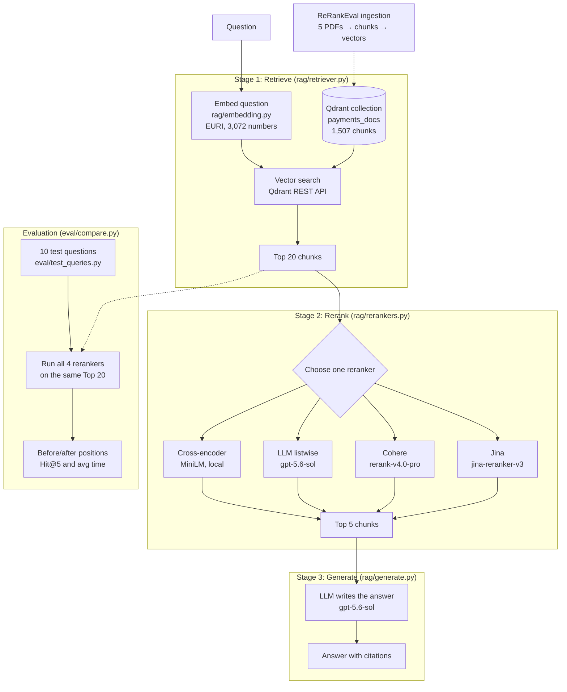

# RAG Reranker Comparison & Evaluation Framework

A retrieval-augmented generation (RAG) pipeline over five payment-industry documents, built and measured in two parts:

1. **Reranker comparison**: retrieve the **Top 20** chunks, rerank them with four different approaches, and send only the **Top 5** to an LLM. Shows the ranking before and after reranking, and explains why the order changed.
2. **Evaluation framework**: score the whole pipeline with **6 retrieval metrics** and **5 generation metrics** over a hand-verified dataset of **43 questions**, and write a traceable evaluation report.

**Documents:** PCI DSS quick reference guide · CPMI-IOSCO principles for financial market infrastructures · CPMI cross-border payments roadmap · Stripe guide to payment methods · FCA approach to payment services and e-money.

## Contents

- [Part 1: Reranker comparison](#part-1-reranker-comparison)
- [Part 2: RAG evaluation framework](#part-2-rag-evaluation-framework)
- [Project structure](#project-structure)
- [Setup](#setup)
- [How to run](#how-to-run)
- [Notes](#notes)

---

## Part 1: Reranker comparison

### Architecture



**Why rerank?** Vector search (a bi-encoder) is fast but imprecise. It embeds the question and each chunk separately, so it finds chunks on the right *topic*, but struggles to tell which one actually *answers* the question. A reranker reads the question and each chunk together and reorders them by relevance. Because only 5 chunks reach the LLM, getting the right chunk into the Top 5 decides the quality of the answer.

### The pipeline

```
Question
   ↓
Stage 1: Retrieve   vector search in Qdrant → Top 20 chunks          (rag/retriever.py)
   ↓
Stage 2: Rerank     one of four rerankers reorders the 20 → Top 5    (rag/rerankers.py)
   ↓
Stage 3: Generate   the LLM answers using only those 5 chunks        (rag/generate.py)
```

### The four rerankers

| Reranker | How it works | Runs | Model |
|---|---|---|---|
| Cross-encoder | A small model reads the question + one chunk together and outputs a score | Locally, free | `cross-encoder/ms-marco-MiniLM-L-6-v2` |
| LLM (listwise) | A general LLM sees all 20 chunks in one prompt and returns them in order | EURI API | `gpt-5.6-sol` |
| Cohere | A large model built only for reranking; returns a score per chunk | Cohere API | `rerank-v4.0-pro` |
| Jina | Another purpose-built reranker, listwise, from a different vendor | Jina API | `jina-reranker-v3` |

### Results

10 test questions over 5 payment-industry PDFs (PCI DSS, CPMI principles for FMIs, cross-border payments roadmap, a payment methods guide, and the FCA's payment services and e-money approach). Each question has a known answer page.

**Position of the first answer chunk** (lower is better; `*` = outside the Top 5, so the LLM never sees it):

| q | Vector (before) | Cross-encoder | LLM | Cohere | Jina |
|---|---|---|---|---|---|
| 1 | 3 | 3 | 1 | 1 | 2 |
| 2 | 1 | 1 | 1 | 1 | 1 |
| 3 | 1 | 1 | 1 | 1 | 1 |
| 4 | 1 | 2 | 1 | 1 | 1 |
| 5 | 2 | 15* | 1 | 1 | 2 |
| 6 | 15* | 6* | 1 | 1 | 1 |
| 7 | 2 | 4 | 2 | 1 | 2 |
| 8 | 1 | 8* | 1 | 1 | 1 |
| 9 | 6* | 4 | 1 | 1 | 2 |
| 10 | 1 | 1 | 1 | 1 | 1 |

**Summary** (Hit@5 = in how many questions the answer reached the Top 5):

| Method | Hit@5 | Avg time per question |
|---|---|---|
| Vector (no reranking) | 8/10 | – |
| Cross-encoder | 7/10 | 1.29s |
| LLM | 10/10 | 4.47s |
| Cohere | 10/10 | 1.04s |
| Jina | 10/10 | 0.81s |

#### Key findings

- **Reranking can rescue a buried answer.** In question 6, vector search placed the answer 15th. The LLM, Cohere and Jina all moved it to 1st.
- **Reranking can also hurt.** The small cross-encoder pushed correct answers out of the Top 5 in questions 5 and 8, scoring below no reranking at all. It's a general web-search model reading specialised, partly scrambled PDF text, and it favoured overview pages that repeat the question's words.
- **The dedicated rerankers were the best trade-off.** Cohere placed the answer 1st in all 10 questions, and Jina was the fastest. The LLM matched them on accuracy but was about 4× slower and used roughly 4,000–9,000 tokens per question.
- **The reranker decides the answer's quality.** On question 5, the same LLM gave a 2-point answer when the cross-encoder dropped the answer page, and a 5-point answer when Cohere kept it.

Results come from a small test set (10 questions), so they show a clear pattern rather than a universal ranking. LLM reranking can vary slightly between runs.

### Why the ordering changed: a worked example

**Question 8:** *"What does PCI DSS Requirement 3 say about protecting cardholder data?"* The answer is on page 14 of the PCI DSS guide, which was split into two chunks.

| Chunk | What it actually contains | Vector | Cross-encoder | LLM | Cohere | Jina |
|---|---|---|---|---|---|---|
| p.14 (first chunk) | The "Protect Cardholder Data" section, but the text is scrambled: two columns and an "Encryption Primer" sidebar were mixed together by PDF extraction | 1 | 8 | 1 | 1 | 1 |
| p.14 (second chunk) | The actual rules, e.g. "3.3 Mask PAN when displayed". Starts mid-word and never says "Requirement 3" | 5 | 18 | 2 | 5 | 4 |
| p.11 | A general introduction: "the goal of PCI DSS is to protect cardholder data…" | 3 | **1** | 6 | 7 | 6 |
| p.40 | The back-cover summary of the whole standard | 4 | **2** | 4–5 | 4 | 2 |
| p.9 | The list of all 12 requirements, including Requirement 3's title | 8 | **3** | 5–6 | 2 | 3 |

**Vector search** ranked by overall topic similarity. All 20 chunks were PCI DSS pages with near-identical scores (0.788 for 1st vs 0.787 for 2nd), so it found the right neighbourhood but could barely separate the answer from its neighbours.

**The cross-encoder** moved general overview pages (p.11, p.40, p.9) to the top and pushed both answer chunks out of the Top 5, for three reasons:
1. **It rewards wording that matches the question.** The overview pages repeat "protect cardholder data" in clean sentences.
2. **It reads word by word, so scrambled text looks incoherent.** The first p.14 chunk was marked down for its mixed-up columns.
3. **It doesn't know the document's structure.** It couldn't link "3.3 Mask PAN" to Requirement 3, so the chunk with the actual rules dropped to 18th.

**The LLM** understood the question rather than matching words. It recognised that sub-requirement 3.3 belongs to Requirement 3 and read past the scrambled text, so it put both answer chunks 1st and 2nd.

**Cohere and Jina** kept the first answer chunk at 1st and the second in the Top 5. They also raised p.9 (the list of requirements), which names Requirement 3 and is partly relevant.

**The lesson:** vector search finds chunks that are *about* the topic, a small general-purpose reranker can prefer chunks that *sound like* the question, and stronger rerankers pick the chunk that *answers* it. Data quality matters too: a reranker can only judge the text PDF extraction gives it.

---

## Part 2: RAG evaluation framework
The reranker comparison above asks *which reranker orders the chunks best*. This framework asks a broader question: **how good is the whole pipeline, from retrieval to the final answer?** It scores the pipeline with **6 retrieval metrics** and **5 generation metrics** over a hand-verified dataset of **43 questions**, and writes a report you can trace back to every individual answer.

### Architecture




```mermaid
flowchart LR
    DS[("Evaluation dataset<br/><b>43 questions</b><br/>expected answers · graded pages · key facts")]

    subgraph PIPE["RAG pipeline under test"]
        direction TB
        Q["Question"] --> R["Vector search<br/>Top 20"]
        R --> RR["Cohere rerank"]
        RR --> T5["Top 5 chunks"]
        T5 --> G["LLM answer<br/>with citations"]
    end

    subgraph SCORE["Scoring"]
        direction TB
        RM["<b>Retrieval metrics</b><br/>Hit Rate · Precision · Recall<br/>MRR · MAP · NDCG"]
        J["<b>LLM judge</b><br/>counts claims, useful chunks,<br/>key facts covered"]
        GM["<b>Generation metrics</b><br/>Faithfulness · Hallucination<br/>Answer & context relevance<br/>Correctness"]
        J --> GM
    end

    DS --> Q
    RR -- "ranked 20 + graded pages" --> RM
    G -- "answer + Top 5 + key facts" --> J
    RM --> RES[("results/results.json<br/>saved after every answer")]
    GM --> RES
    RES --> REP["reports/evaluation_report.md<br/>averages · by question type · per question"]

    classDef data fill:#EEF2FF,stroke:#6366F1,color:#1E1B4B
    classDef stage fill:#F0FDF4,stroke:#16A34A,color:#14532D
    classDef score fill:#FFF7ED,stroke:#EA580C,color:#7C2D12
    classDef out fill:#F8FAFC,stroke:#475569,color:#0F172A
    class DS,RES data
    class Q,R,RR,T5,G stage
    class RM,J,GM score
    class REP out
```

**Retrieval metrics** are pure arithmetic against the dataset's graded pages, with no LLM involved. **Generation metrics** come from an LLM judge that returns *counts* (claims, supported claims, useful chunks, key facts covered); the code then turns those counts into scores with simple division, so every score can be checked by hand.

### The evaluation dataset

Every question was written from the source PDFs, and every page number was verified with `pdfplumber` using the same 1-based numbering as ingestion, so the ground truth lines up with what Qdrant returns.

| Question type | Count | Example | What it tests |
|---|---:|---|---|
| **Direct** | 27 | *"Who chairs the CPMI Cross-border Payments Task Force?"* | Basic lookup of a fact, list or definition |
| **Multi-page** | 8 | *"How must a payment institution safeguard customers' money?"* | Finding an answer spread over several pages |
| **Vague** | 3 | *"If hackers stole our customer database, how do we make the card numbers useless to them?"* | Everyday wording instead of the document's terms |
| **Cross-document** | 3 | *"What do PCI DSS and the FCA each require for authenticating users?"* | Combining two different PDFs |
| **Unanswerable** | 2 | *"How much does Stripe charge per transaction for iDEAL?"* | Saying "the documents don't answer this" instead of guessing |

Each question carries:

- **`expected_answer`**: the reference answer, written from the page text
- **`relevant_pages`**: every page that answers it, graded **2** (contains the answer) or **1** (partly relevant)
- **`key_facts`**: a fixed checklist of the points a complete answer must contain, so correctness is measured against the same list on every run

### The metrics

**Retrieval**: did the right pages reach the Top 5 the LLM sees?

| Metric | Question it answers | How it's calculated |
|---|---|---|
| **Hit Rate@5** | Did *any* relevant page reach the Top 5? | 1 if yes, 0 if no, averaged over questions |
| **Precision@5** | How much of the Top 5 was relevant? | relevant chunks in Top 5 ÷ 5 |
| **Recall@5** | How much of *all* the relevant material reached the Top 5? | relevant pages in Top 5 ÷ all relevant pages |
| **MRR** | How high was the *first* relevant page? | 1 ÷ its position (1st = 1.0, 2nd = 0.5 …) |
| **MAP** | How high were *all* the relevant pages? | average of the precision at each relevant page |
| **NDCG@5** | Were the *best* pages (grade 2) at the very top? | Σ (2^grade − 1) ÷ log₂(position + 1), divided by the ideal order |

Each relevant page counts **once**: a page split into two chunks is only credited at its first appearance. MRR and MAP look at all 20 retrieved chunks; the @5 metrics look only at the Top 5.

**Generation**: is the answer grounded, relevant and correct?

| Metric | Compares | Question it answers | How it's calculated |
|---|---|---|---|
| **Faithfulness** | answer ↔ chunks | Is every claim backed by the Top 5 chunks? | supported claims ÷ all claims |
| **Hallucination rate** | answer ↔ chunks | How often does an answer contain *any* unsupported claim? | answers with ≥ 1 unsupported claim ÷ all answers |
| **Answer relevance** | answer ↔ question | Does the answer address what was asked? | judge's score: 1.0 / 0.5 / 0.0 |
| **Context relevance** | chunks ↔ question | Were the 5 chunks actually useful? | useful chunks ÷ 5 |
| **Answer correctness** | answer ↔ key facts | Does the answer contain the right facts? | key facts covered ÷ all key facts |

A claim that is true in real life but **not stated in the chunks** counts as unsupported: faithfulness measures whether the answer stuck to its sources, not general truth.

### Results

43 questions, Cohere reranking, `gpt-5.6-sol` for both answering and judging. Full tables: [`reports/evaluation_report.md`](reports/evaluation_report.md).

| Retrieval | Score | | Generation | Score |
|---|---:|---|---|---:|
| Hit Rate@5 | **1.00** | | Faithfulness | **1.00** |
| Precision@5 | [fill] | | Hallucination rate | **0.00** |
| Recall@5 | 0.94 | | Answer relevance | [fill] |
| MRR | 0.95 | | Context relevance | [fill] |
| MAP | [fill] | | Answer correctness | **0.97** |
| NDCG@5 | 0.91 | | | |

Retrieval averages cover the 41 answerable questions; unanswerable questions have no correct pages, so they are scored on generation only.

**By question type**

| Type | Questions | Recall@5 | NDCG@5 | Faithfulness | Correctness |
|---|---:|---:|---:|---:|---:|
| Direct | 27 | 0.98 | 0.97 | 1.00 | 0.99 |
| Vague | 3 | 1.00 | 0.99 | 1.00 | 1.00 |
| Multi-page | 8 | 0.83 | 0.77 | 1.00 | 0.94 |
| Cross-document | 3 | 0.78 | 0.72 | 1.00 | 0.89 |
| Unanswerable | 2 | – | – | 1.00 | 1.00 |

### Key findings

- **Direct and vague questions are handled almost perfectly.** Semantic search plus Cohere copes well with everyday wording on this document set.
- **Answers spread across pages or documents are harder.** Multi-page recall drops to 0.83 and cross-document to 0.78. With only 5 slots, one document tends to crowd out the other: on Q40 (PCI DSS *and* FCA authentication) only 1 of 3 relevant pages reached the Top 5, and the answer covered 2 of 3 key facts.
- **The system says "I don't know" when it should.** Both unanswerable questions were answered with "the documents don't answer this" rather than an invented figure.
- **Good retrieval scores and good answers are not the same thing.** Q31 had the weakest retrieval (NDCG 0.12), yet a partly relevant page contained the answer and correctness reached 0.75.
- **No hallucinations across 43 answers.** To make sure this wasn't a blind judge, it was given a deliberately wrong answer with two invented claims: it caught both (faithfulness 0.33, hallucination 1).

### Limitations

- **The judge is the same model that writes the answers**, so generation scores may be somewhat lenient. The deliberate-hallucination test above is a sanity check, not proof; a different judge model would be stronger.
- **Most questions are direct lookups** over a small, clean set of 5 PDFs, written with the documents' own vocabulary. The harder categories have only 2–3 questions each, so their averages are directional rather than precise.
- **Precision@5 has a ceiling below 1.0** for questions with fewer than 5 relevant pages (0.20 for a single page), so it reads low by design.
- **One configuration (Cohere)** was evaluated end to end to fit a daily token budget. The reranker comparison above covers the other configurations on retrieval.

---

## Project structure

```
RAG-Reranker-Comparison/
  rag/
    embedding.py           EURI embedder (copied from ReRankEval)
    chat_model.py          EURI chat model wrapper (copied from ReRankEval)
    retriever.py           Stage 1: Top 20 from Qdrant (REST API)
    rerankers.py           Stage 2: cross-encoder, LLM, Cohere and Jina rerankers
    generate.py            Stage 3: answer from the Top 5; runs the whole pipeline
  eval/
    test_queries.py        Part 1: 10 questions with their answer pages
    compare.py             Part 1: all four rerankers on the 10 questions
    eval_dataset.py        Part 2: 43 questions with expected answers, graded pages, key facts, type
    retrieval_metrics.py   Part 2: Hit Rate, Precision, Recall, MRR, MAP, NDCG (pure arithmetic)
    generation_metrics.py  Part 2: LLM judge + faithfulness, hallucination, relevance, correctness
    run_evaluation.py      Part 2: runs every question, saves results after each answer
    report.py              Part 2: averages, results by question type, per-question table
  results/results.json     every answer, its Top 5 pages, scores and the judge's reply
  reports/evaluation_report.md
  tests/
    test_connection.py
```

## Setup

**1. The document collection.** This project reads an existing Qdrant collection built by [ReRankEval](../ReRankEval)'s ingestion (1,507 chunks, 3,072-dimension EURI embeddings). Run ReRankEval's `python -m rag.ingest` first, with `QDRANT_COLLECTION=payments_docs`.

**2. Environment variables.** Copy `.env.example` to `.env` and fill in:

```
EURI_API_KEY, EURI_BASE_URL, EURI_EMBED_MODEL, CHAT_MODEL
QDRANT_URL, QDRANT_API_KEY, QDRANT_COLLECTION
COHERE_API_KEY, JINA_API_KEY
```

The EURI and Qdrant values must match the ones ReRankEval used for ingestion, especially `EURI_EMBED_MODEL`, so questions are embedded the same way as the stored chunks.

**3. Install:**

```bash
python -m venv .venv
source .venv/Scripts/activate      # Windows (Git Bash)
python -m pip install -r requirements.txt
python -m tests.test_connection
```

## How to run

**Part 1: reranker comparison**

```bash
# Stage 1 only: the Top 20 from vector search, for the PCI DSS test question
python -m rag.retriever

# Stage 2: before/after table for one reranker (cross, llm, cohere or jina)
python -m rag.rerankers cohere

# all 10 questions, all four rerankers
python -m eval.compare

# whole pipeline for one question: reranker name + question number
python -m rag.generate cohere 6
```

**Part 2: evaluation framework**

```bash
# quick, cheap test on the first 2 questions (~13,000 tokens)
python -m eval.run_evaluation 2

# full run: all 43 questions (~280,000 tokens); finished results are skipped
python -m eval.run_evaluation

# build the report from the saved results (no API calls)
python -m eval.report

# check the metrics on one question end to end
python -m eval.retrieval_metrics
python -m eval.generation_metrics cohere 5
```

- **Progress is saved after every answer.** If a run stops (network error, rate limit, daily token limit), run the same command again and it continues where it left off.
- **To evaluate another configuration**, add it to `CONFIGURATIONS` in `eval/run_evaluation.py`, e.g. `["vector", "cohere"]`. Saved results are reused, so only the new configuration costs tokens.
- **After changing the dataset or a prompt**, delete `results/results.json` (or the affected entries) so old scores aren't reused.

## Notes

- **Windows Smart App Control** blocked compiled files inside `scikit-learn` and `grpc`. To avoid them, the cross-encoder runs through `transformers` + `torch` directly (not `sentence-transformers`), and the retriever calls Qdrant's REST API with `requests` (not `qdrant-client`).
- **Score scales differ between rerankers.** Cohere scores run from 0 to 1, Jina's can be negative, the cross-encoder's are unbounded, and the LLM's are derived from its ordering (20 down to 1). Compare the **order** each produces, not the score values.
- **Jina's open weights** are released under a non-commercial licence (CC BY-NC 4.0), so self-hosting them is limited to non-commercial use.
- **Embedding rate limits.** The EURI embedding model has a per-minute request limit; scripts that embed many questions in a row should pause briefly between them.